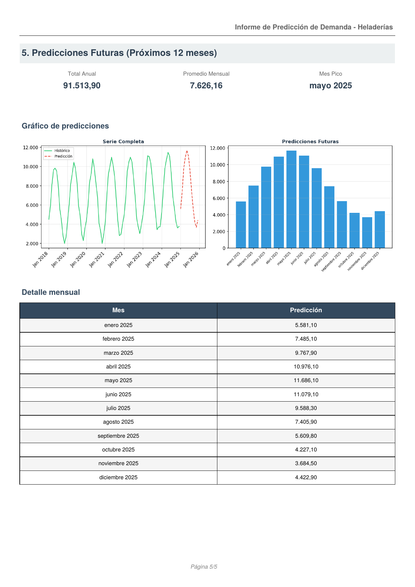

# 🍦 Predicción de Demanda para Heladerías


Aplicación en Python + Streamlit para analizar ventas históricas de heladerías y generar predicciones mensuales de demanda usando el modelo de series temporales **Holt-Winters**.

> 📌 **Demo en vivo:** [prediccion-heladerias.streamlit.app](https://tu-app.streamlit.app) ← reemplazar con la URL real

---

## Problema de negocio

Las heladerías tienen una demanda fuertemente estacional. Una mala estimación puede generar quiebres de stock en temporada alta o sobre-stock en temporada baja, con impacto directo en costos y rentabilidad.

Este proyecto permite anticipar la demanda mensual para mejorar decisiones de compra, producción y planificación financiera.

---

## Qué hace la aplicación

- Carga archivos CSV o Excel con ventas históricas por mes y año.
- Valida el formato del archivo antes de procesarlo, con mensajes de error claros.
- Transforma las ventas en serie temporal y las visualiza.
- Corrige meses atípicos afectados por la pandemia 2020 (opcional).
- Evalúa automáticamente 4 combinaciones de Holt-Winters y elige la de menor MAE.
- Compara ventas reales vs predicción en el período de validación.
- Calcula MAE, RMSE, R² y error absoluto total.
- Genera predicciones para los próximos 12 meses.
- Exporta las predicciones en CSV y un informe completo en PDF.

---

## Modelo utilizado

**Holt-Winters / Exponential Smoothing** — adecuado para series con tendencia y estacionalidad mensual.

Se evalúan automáticamente estas combinaciones y se selecciona la de menor MAE sobre el período de validación:

| Tendencia   | Estacionalidad  |
|-------------|-----------------|
| Aditiva     | Aditiva         |
| Aditiva     | Multiplicativa  |
| Sin tendencia | Aditiva       |
| Sin tendencia | Multiplicativa |

**Requisito mínimo:** 3 años de datos (36 meses), para garantizar al menos 2 ciclos estacionales completos en el conjunto de entrenamiento.

---

## Estructura del proyecto

```
prediccion_heladerias/
│
├── app.py                  # UI Streamlit (solo presentación, sin lógica)
├── requirements.txt        # Dependencias con versiones fijadas
│
├── src/                    # Lógica de negocio
│   ├── __init__.py         # API pública del paquete
│   ├── formatting.py       # Formato de números y texto (estilo argentino)
│   ├── loader.py           # Carga, transformación y corrección de datos
│   ├── validator.py        # Validación del schema del archivo de entrada
│   ├── model.py            # Pipeline Holt-Winters: selección, métricas, predicciones
│   └── report.py           # Generación del informe PDF
│
├── tests/                  # Suite de tests (103 tests, pytest)
│   ├── conftest.py         # Fixtures compartidos
│   ├── test_formatting.py
│   ├── test_loader.py
│   ├── test_validator.py
│   └── test_model.py
│
└── data/
    └── ejemplo_ventas.csv  # Datos sintéticos para probar sin datos reales
```

---

## Ejemplo de informe generado

La app exporta un informe PDF completo (5 páginas) con datos cargados, serie histórica, métricas de validación y predicciones futuras. Ejemplo generado con datos sintéticos:



---

## Formato esperado del archivo

El archivo debe tener una columna de año y una columna por mes (en español, mayúsculas):

| AÑO  | ENERO | FEBRERO | MARZO | ... | DICIEMBRE |
|------|-------|---------|-------|-----|-----------|
| 2022 | 1200  | 1150    | 980   | ... | 1300      |
| 2023 | 1280  | 1190    | 1010  | ... | 1380      |
| 2024 | 1350  | 1220    | 1050  | ... | 1420      |

- Acepta `.csv` (con separador `;` o `,`) y `.xlsx`.
- Acepta números con coma decimal y punto como separador de miles (formato argentino/europeo).
- La app incluye un botón para descargar la plantilla Excel con el formato correcto.

---

## Instalación y ejecución local

```bash
git clone https://github.com/ayankilevich-cpu/prediccion-heladerias-.git
cd prediccion-heladerias-

pip install -r requirements.txt

streamlit run app.py
```

---

## Tests

La suite cubre los 4 módulos principales con 103 tests unitarios e de integración.

```bash
# Correr todos los tests
pytest tests/ -v

# Correr solo un módulo
pytest tests/test_model.py -v

# Ver resumen sin detalle
pytest tests/
```

Resultado esperado:
```
103 passed in ~6s
```

Los tests verifican, entre otras cosas:
- Que el formato numérico argentino se convierte correctamente.
- Que los NaN históricos se imputan por el promedio del mismo mes.
- Que la corrección de pandemia no modifica años distintos a 2020.
- Que el modelo lanza un error claro si los datos son insuficientes (< 3 años).
- Que train y test nunca se solapan temporalmente.

---

## Tecnologías

| Librería       | Uso                                      |
|----------------|------------------------------------------|
| Streamlit      | Interfaz web                             |
| Pandas         | Manipulación de datos                    |
| NumPy          | Operaciones numéricas                    |
| Statsmodels    | Modelo Holt-Winters                      |
| Scikit-learn   | Métricas de evaluación (MAE, RMSE, R²)  |
| Plotly         | Gráficos interactivos en la UI           |
| Matplotlib     | Gráficos estáticos para el PDF           |
| FPDF2          | Generación del informe PDF               |
| OpenPyXL       | Lectura y escritura de archivos Excel    |
| pytest         | Suite de tests                           |

---

## Datos de ejemplo

El repositorio incluye `data/ejemplo_ventas.csv` con datos sintéticos para probar la aplicación sin necesidad de datos reales.

---

## Autor

**Alejandro Yankilevich**  
Data Analyst — [LinkedIn](https://linkedin.com/in/aleyanki
